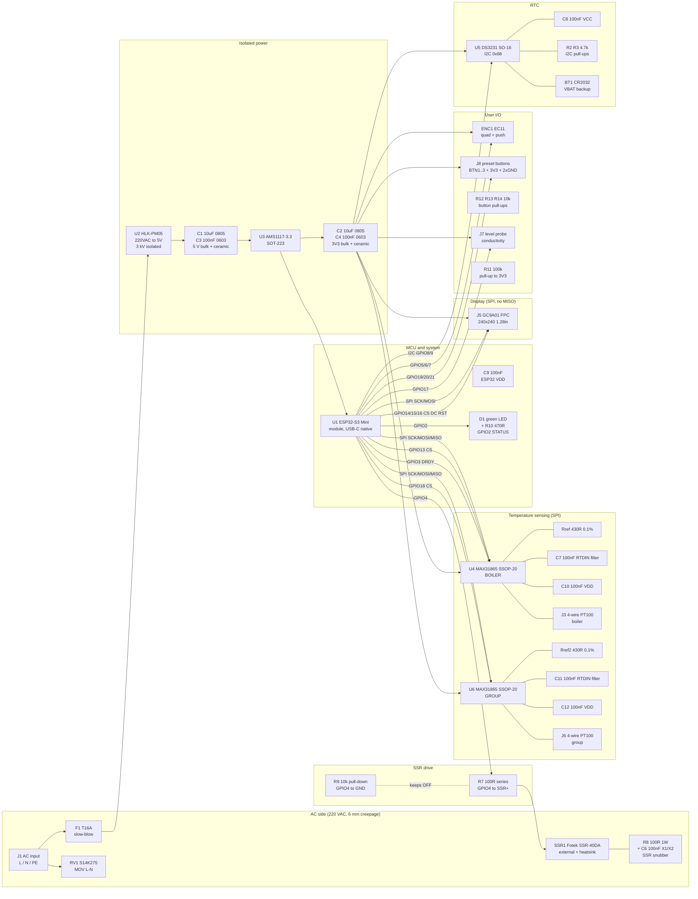

# Faema President Control — Block Diagram

**Circuit:** `faema_president_control`
**Revision:** Rev.4 (SKiDL migration from existing KiCad Rev.4)
**Architect pass:** initial
**Source of truth going forward:** SKiDL (replaces `kicad/*.kicad_sch`)

---

## 1. High-level block diagram

---

## 2. Functional block list (for modular coding stage)

| # | block_id | description | primary parts | AC/DC domain |
|---|----------|-------------|---------------|--------------|
| 1 | `ac_input_protection` | Mains entry, fuse, MOV, terminal block | J1, F1, RV1 | AC (isolated island) |
| 2 | `power_5v`            | HLK-PM05 AC/DC module + bulk | U2, C1, C3 | AC in / DC out (isolated barrier inside U2) |
| 3 | `power_3v3`           | AMS1117 LDO + bulk | U3, C2, C4 | DC |
| 4 | `mcu_esp32s3`         | ESP32-S3 Mini module + VDD bypass | U1, C9 | DC |
| 5 | `temp_sense_boiler`   | MAX31865 + Rref + caps + PT100 header | U4, Rref, C7, C10, J3 | DC |
| 6 | `temp_sense_group`    | MAX31865 + Rref2 + caps + PT100 header | U6, Rref2, C11, C12, J6 | DC |
| 7 | `rtc_ds3231`          | DS3231 + backup battery + I2C pull-ups + bypass | U5, R2, R3, C8, BT1 | DC |
| 8 | `display_gc9a01`      | FPC header for round IPS display | J5 | DC |
| 9 | `user_io`             | Encoder, preset buttons, level probe, status LED | ENC1, J8, R12, R13, R14, J7, R11, D1, R10 | DC |
| 10 | `ssr_drive_snubber`  | GPIO4 drive, pull-down, series R, RC snubber, external SSR header | R7, R9, R8, C6, SSR1 header | mixed (R7/R9 DC side; R8/C6 AC side with 6 mm clearance) |

**Total blocks = 10.** Per orchestrator rules (§Coding Mode Decision, step 5b): `block_count > 3` → **modular mode** will be used at the coding stage. Block IDs above are the canonical filenames for `circuits/faema_president_control/*.py`.

---

## 3. Bus summary

| Bus | Members | Speed / mode | Notes |
|-----|---------|--------------|-------|
| SPI | U1 master, U4 + U6 + J5 (GC9A01) slaves | MAX31865 mode 1/3 @ <= 5 MHz, GC9A01 mode 0 @ up to 80 MHz | Firmware reconfigures mode per transaction. GC9A01 does not use MISO. |
| I2C | U1 master, U5 slave (0x68) | Standard 100 kHz (fast 400 kHz OK) | 4.7 kOhm pull-ups to 3V3 (R2/R3) |
| Discrete GPIO | LED, SSR gate, encoder, buttons, level probe, DRDY, CS, DC, RST | DC | See net_plan.md |

---

## 4. AC/DC isolation strategy

- **AC island** = J1, F1, RV1, HLK-PM05 primary, R8+C6 snubber, SSR1 header terminals (the SSR output terminals, not the DC-side control pins).
- **DC island** = everything else, referenced to GND.
- Isolation barrier = HLK-PM05 (3 kV reinforced) + SSR-40DA optocoupler (2.5 kV typical).
- **Minimum creepage 6 mm** between any AC net and any DC net, enforced at layout time. All AC copper on bottom layer, slot-routed where it crosses DC.
- The SSR control side (GPIO4 via R7/R9) is DC. The SSR output side (AC hot to boiler) is AC and lives entirely on the AC island.

See `design_risks.md` for layout, EMI, and thermal risks.
